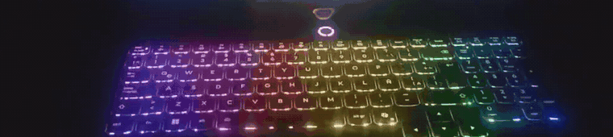
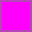
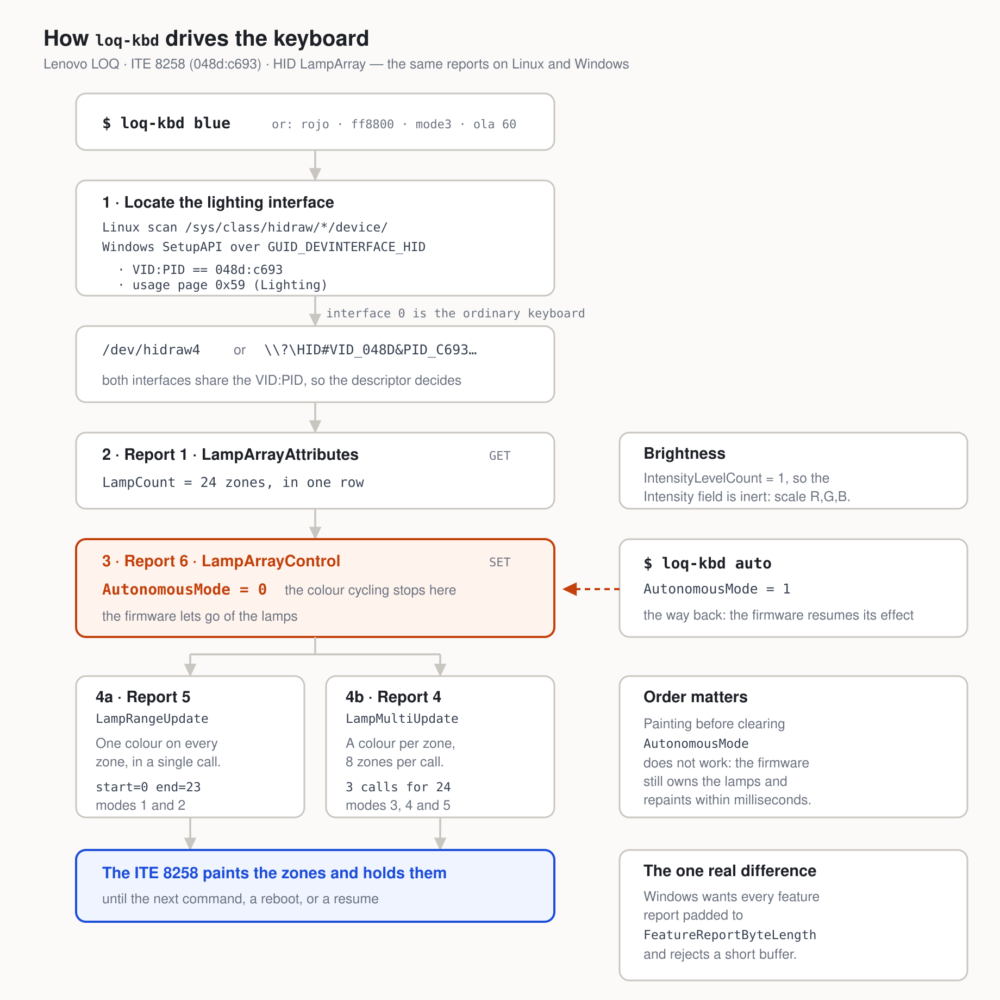

# loq-kbd — Fixed Colours and Effects for the Lenovo LOQ RGB Keyboard

<div align="center">

</div>

</br>

<div align="center" width="70%">

[](#)
[](#)
[](#)
[](#tested-configuration)
[](#tested-configuration)
[](#commands)
[](#how-it-works)
[](LICENSE)
[](https://github.com/MrDavidAlv/loq-kbd)


</div>

---

## Quick Start

```bash
# 1. Get the files
git clone https://github.com/MrDavidAlv/loq-kbd.git
cd loq-kbd

# 2. Install — udev rule, systemd service, and loq-kbd on your PATH
sudo ./install.sh

# 3. Open a NEW terminal and set a colour
loq-kbd red
loq-kbd purple 60         # at 60% brightness

# 4. Keep it after a reboot
loq-kbd save purple 60
```

No git? Use the green **Code** button above → **Download ZIP**, then open a
terminal in the folder you unzipped.

On Windows, step 2 is `.\install.ps1` — see [Installation](#installation).
Every command, including the Spanish ones, is under [Commands](#commands).

---

## Table of Contents

- [Description](#description)
- [Will It Work on My LOQ?](#will-it-work-on-my-loq)
- [Installation](#installation)
- [Commands](#commands)
- [Spanish Commands](#spanish-commands)
- [Effects](#effects)
- [Making It Permanent](#making-it-permanent)
- [How It Works](#how-it-works)
- [Video Demonstration](#video-demonstration)
- [Tested Configuration](#tested-configuration)
- [Troubleshooting](#troubleshooting)
- [Project Structure](#project-structure)
- [Contact](#contact)

---

## Description

The Lenovo LOQ keyboard keeps changing colour by itself, and nothing in your
desktop settings stops it. That is not a misconfigured shortcut: the lighting
controller boots into *autonomous mode* and runs its own colour-cycling effect
internally, with no involvement from the operating system. On Linux the keyboard
does not even appear under `/sys/class/leds/`, so `brightnessctl` and your
desktop's brightness keys cannot see it at all.

This clears one bit to take that effect away, then paints the colour you asked
for — by name in English or Spanish, by hex code, or as one of five effects. It
runs on Linux and Windows from a single Python file using only the standard
library, and reapplies your choice after a reboot or a resume.

---

## Will It Work on My LOQ?

You need a LOQ whose keyboard shows **colours**, not just white light. Check in
one command — on Linux:

```bash
lsusb | grep -i 048d
```

On Windows PowerShell:

```powershell
Get-PnpDevice -Class HIDClass | Where-Object InstanceId -match 'VID_048D'
```

<div align="center">

| What you see | What it means |
|---|---|
| `048d:c693` | should work |
| nothing | white backlight only, no colours to set — use `Fn`+`Space` for brightness |
| `048d:` and a different number | a related chip; likely works after changing `PRODUCT_ID` in `loq_kbd.py` and `idProduct` in `60-loq-keyboard.rules`, then reinstalling |

</div>

Only one model is confirmed so far — see
[Tested Configuration](#tested-configuration).

---

## Installation

### Linux

```bash
sudo ./install.sh
```

That is the whole install. It asks for your password because only the system can
grant your user access to the keyboard lights. Then open a **new** terminal and
try `loq-kbd red`. If it still says `command not found`, run `source ~/.bashrc`.

### Windows

Python first, if you do not have it:

```powershell
winget install Python.Python.3.12
```

Then, in the folder you cloned:

```powershell
.\install.ps1
loq-kbd red          # in a new PowerShell window
```

If PowerShell refuses to run the script:
`Set-ExecutionPolicy -Scope CurrentUser RemoteSigned`.

**Check Windows first, though.** Windows 11 already has this built in, under
**Settings → Personalization → Dynamic Lighting** — this keyboard is a standard
HID LampArray device, so Windows can drive it with nothing installed. Use this
instead if you are on Windows 10, if you want the effects, or if you want one
set of commands on both systems. If you do, turn Dynamic Lighting **off**, or
the two will fight over the keyboard.

---

## Commands

```
loq-kbd red                 a fixed colour
loq-kbd purple 60           a colour at 60% brightness
loq-kbd ff8800              a colour by hex: 6 digits or 3, # optional
loq-kbd mode3               an effect, 1 to 5
loq-kbd mode2 blue 80       an effect in the colour you choose
loq-kbd off                 lights out
loq-kbd auto                back to the chip's own colour cycling

loq-kbd save mode3 50       remember this for next time you switch on
loq-kbd apply               use what you saved

loq-kbd colours             every colour name
loq-kbd modes               every effect
loq-kbd info                what your keyboard reports about itself
loq-kbd zones               each lighting zone, one per line
```

In bash, quote a hex colour or the shell eats the `#`: `loq-kbd '#ff8800'`.

---

## Spanish Commands

**Every colour, every effect and every subcommand also works in Spanish.** These
pairs do exactly the same thing:

```
loq-kbd red          =  loq-kbd rojo            loq-kbd mode3    =  loq-kbd modo3
loq-kbd purple 60    =  loq-kbd morado 60       loq-kbd wave     =  loq-kbd ola
loq-kbd white        =  loq-kbd blanco          loq-kbd off      =  loq-kbd apagado
loq-kbd colours      =  loq-kbd colores         loq-kbd save     =  loq-kbd guardar
loq-kbd modes        =  loq-kbd modos           loq-kbd apply    =  loq-kbd aplicar
loq-kbd zones        =  loq-kbd zonas           loq-kbd help     =  loq-kbd ayuda
```

<div align="center">

| English | Spanish | | English | Spanish |
|---|---|---|---|---|
|  `red` | `rojo` |  |  `green` | `verde` |
|  `blue` | `azul` |  |  `white` | `blanco` |
|  `black` | `negro` |  |  `cyan` | `cian` |
|  `magenta` | `magenta` |  |  `yellow` | `amarillo` |
|  `orange` | `naranja` |  |  `purple` | `morado` |
|  `pink` | `rosa` |  |  `mint` | `menta` |
|  `gold` | `dorado` |  |  `silver` | `plata` |
|  `teal` | `verdeazulado` |  |  `indigo` | `indigo` |
|  `brown` | `marron` |  |  `gray` | `gris` |
|  `lime` | `lima` |  |  `turquoise` | `turquesa` |
|  `coral` | `coral` |  |  `lavender` | `lavanda` |

</div>

Plus `violet`/`violeta`, `warm`/`calido`, `cold`/`frio`, `grey`. Run
`loq-kbd colours` for the live list.

---

## Effects

<div align="center">

| | English | Spanish | What you see |
|:--:|---|---|---|
| 1 | `static` | `estatico` | one fixed colour — the default |
| 2 | `breathing` | `respiracion` | one colour fading in and out |
| 3 | `wave` | `ola` | a rainbow travelling along the keyboard |
| 4 | `gradient` | `degradado` | a still rainbow, left to right |
| 5 | `spectrum` | `espectro` | the whole keyboard cycling through colours |

</div>

Write one however you like — `mode3`, `modo3`, `m3`, `3`, `wave` and `ola` are
all the same. Effects 1 and 4 finish immediately. Effects 2, 3 and 5 move, so
they keep running in your terminal until you press **Ctrl-C**; to leave one on
permanently, `loq-kbd save mode3` and it runs in the background instead.

`auto` hands control back to the chip, which resumes the colour cycling you were
escaping. It cannot pick *which* of the chip's built-in effects to run — the
standard only offers on or off, which is why effects 1 to 5 are produced by the
host instead. In exchange you get to choose their colour and brightness, which
the chip's own effects do not allow.

---

## Making It Permanent

The chip forgets everything on shutdown and on sleep. One command fixes that for
good:

```bash
loq-kbd save blue 60      # or: loq-kbd save mode3 50
```

The installer already set up the part that reapplies it — a systemd service on
Linux, a scheduled task on Windows.

---

## How It Works

The keyboard exposes **HID LampArray** (HID Usage Page `0x59`), the standard
lighting protocol — not a vendor one. That is unusual for Legion and LOQ
hardware, where controlling the lighting normally means replaying byte sequences
recovered by reverse engineering. Here the reports are public and documented,
which is also why the same code drives both operating systems: only the
transport differs, `hidraw` against `hid.dll`.

<div align="center">
<picture>
  <source media="(prefers-color-scheme: dark)" srcset="images/diagram-dark.png">
  
</picture>
</div>

Three things worth knowing if you plan to change anything:

- **Order matters.** Painting before clearing `AutonomousMode` does nothing —
  the firmware still owns the lamps and repaints over you within milliseconds.
- **Brightness is emulated.** This controller reports
  `IntensityLevelCount = 1`, so the standard's `Intensity` field is inert and
  brightness has to be applied by scaling R, G and B.
- **There are 24 zones, all in one row.** Every zone reports the same Y, so
  horizontal effects work and vertical ones are not possible.

The report layouts, the byte-level details and the traps behind each of the
above are commented where they apply, in `loq_kbd.py`,
`60-loq-keyboard.rules` and `loq-kbd.service`. `loq-kbd info` and
`loq-kbd zones` print what your own keyboard reports.

---

## Video Demonstration

<div align="center">

<video src="images/keyboard.mp4" poster="images/keyboard-poster.jpg" controls muted loop width="760"></video>

**[Watch the demonstration](images/keyboard.mp4)**

*Colours and effects set from the terminal, 40 s. Filmed on a phone.*

</div>

---

## Tested Configuration

<div align="center">

| | |
|---|---|
| **Laptop** | Lenovo LOQ 15AHP10 (model `83JG`), board `LNVNB161216` |
| **Keyboard chip** | ITE 8258, USB `048d:c693`, 24 lighting zones |
| **OS** | Ubuntu 22.04.5 LTS · Linux 6.8.0-138 · GNOME on Wayland |
| **Python** | 3.11 |

</div>

Everything in this README is confirmed working on the above. Not tested:

- **Windows.** Written against Microsoft's API documentation and against what
  this keyboard really reports, and it shares all its logic with the Linux half
  that does work. But it has never been run — there is no Windows on the machine
  this was built on. If something is broken, it is here.
- **Other LOQ models.** Only the 15AHP10 above. Others with RGB keyboards very
  likely use the same chip, but nobody has checked.
- **Sleep and wake.** Set up and verified at boot, but no one has closed the lid
  and opened it again to watch it happen.

---

## Troubleshooting

<div align="center">

| Problem | Fix |
|---|---|
| `loq-kbd: command not found` | open a new terminal, or `source ~/.bashrc` |
| `no permission on /dev/hidraw4` | run `sudo ./install.sh`; if you already did, log out and back in once |
| cycling returns after a restart | run `sudo ./install.sh` again |
| Windows: nothing happens | turn off Settings → Personalization → Dynamic Lighting |
| `no LampArray interface for 048d:c693` | see [Will It Work on My LOQ?](#will-it-work-on-my-loq) |

</div>

---

## Project Structure

<div align="center">

| File | What it is |
|---|---|
| `loq_kbd.py` | the whole tool: both transports, colours, effects, CLI |
| `loq-kbd` · `loq-kbd.ps1` · `loq-kbd.cmd` | launchers for bash, PowerShell and cmd |
| `install.sh` · `install.ps1` | the installers (`.ps1` takes `-Uninstall`) |
| `60-loq-keyboard.rules` | udev rule for access without `sudo` |
| `loq-kbd.service` | the systemd unit for boot and resume |
| `color.conf.example` | template for your saved colour |
| `render_diagram.py` | regenerates the diagram PNGs from the SVG |
| `images/` | cover, diagram and demonstration video |

</div>

---

## Contact

**Author**: Mario David Alvarez Vallejo
**Repository**: [github.com/MrDavidAlv/loq-kbd](https://github.com/MrDavidAlv/loq-kbd)
**License**: MIT -- see [LICENSE](LICENSE)
